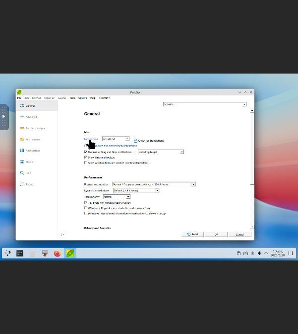

# PeaZip 11.3.0 适配验收与本地上架

PeaZip 已通过规定的功能验收并在本地 ForgeStore 发布，累计 **11/1000** 个独立 Windows 应用。目录为 candidate-v11，TUF targets/snapshot/timestamp 版本均为 20，已有可信根保持不变。13 个市场条目中另有 2 个内部夹具，未计入应用数量。

## 修复与执行证据

官方固定 EXE 为 11,391,512 字节，SHA-256 为 `cb52763da39ef44f6b8ce3619eb76817aa8b2e4c3518c406dc5cc2857bcaeb76`；与先前保存的官方资产摘要及 SHA256.txt 相符。许可为 LGPLv3，附带组件的许可和声明仍适用。仓库只保存公开签名元数据与验收收据，安装包缓存和私钥保持私有。

原黑色 OK/Cancel 按钮问题通过已批准的 classic 外观配置解决。Recipe 与安装提交明确绑定 classic，准备阶段使用独立授权、绝对路径和摘要固定的 Wine 注册表工具，把该前缀 ThemeActive 写为 REG_SZ 0 并回读。历史 runtime bindings 不因新增工具策略改写。准备操作先取得持久化取消所有者，再进入辅助进程和安装器启动边界；取消和服务关停必须确认清理，清理不安全时保留所有权/隔离。

实际部署基线包含 generation 与 debuggerRuntime 支持。最终补丁、逐文件前后摘要保存在 CompatForge `docs/patches/2026-09-30-stage2-profile-preparing.*`，工作分支为 `fix/peazip-classic-theme`。部署的 CompatForge SHA-256 为 `12c0404f79f2d063e2e5e71d42981ebbecd102b5770d363588f1e7c1a4938f62`；ForgeStore SHA-256 为 `eafd2d9d07f20d6413e2a55bae17bec7e637b44b57745f8e3829786ea8cd3ca3`。原配置和旧服务二进制保留。初次选择的旧构建源缺少部署中的 debuggerRuntime，失败后恢复旧服务；改用实际 stage2 基线并使用独立构建目录后成功。没有把失败的激活记成部署成功。

回归输出确认 domain 16、orchestrator 37、process 111、service 84、debug 22 项通过；服务的 2 个隔离助手未直接执行，另有独立所有权子进程测试通过。Store core 测试和 release 构建通过。详细命令和结果见 [服务部署记录](2026-10-01-peazip-service-deployment.json)。

## 真实功能与生命周期

| 阶段 | 实际结果 |
| --- | --- |
| 提交不一致的 appearance 期望 | 在创建 staging generation 前拒绝 |
| 准备阶段取消 | preparing → cancelling → cancelled，实测 0.242 秒；未启动安装器，前缀残留进程为 0，旧选中代际保留 |
| 准备阶段服务重启 | 作业取消且确认 supervisor cleanup；未把取消代际选为完成代际 |
| 新托管安装 | `job-1790781229872-2` 成功，自动 classic，安装器正常退出 |
| 新代际真实 GUI | Add 创建 ZIP，Extract 解压；740 字节 ASCII 文件及 53 字节中文文件与输入逐字节一致；成员 CRC 正确 |
| 界面、退出与重开 | Add/Extract/General Settings 的 OK/Cancel 清晰；归档重开显示中文文件名，两次退出均为 0 |
| TUF 与本地市场 | 以原可信根完成签名及独立验签，激活 13 条目，完整旧作业与安装状态保留 |
| 市场更新 | Store 作业成功，新代际 `gen-job-1790787576467-3` 自动 classic；GUI 解压复制的验收 ZIP，两个输出文件摘要/长度一致；设置按钮正常，退出 0 |
| 市场回退 | Store 作业成功，精确选回 `gen-job-1790781229872-2`；原归档、中文条目可重开，退出 0 |
| 市场重启 | 全部 38 条作业、安装和目录状态保留；持久化 TUF 元数据仍为 20，根版本 1 |

原始新代际 GUI ZIP 是 696 字节，SHA-256 为 `a457083371fea1222708d509348a6dcf8bb795c5e079f5fb1227dc85b095598e`。市场更新代际使用这份 ZIP 作为复制的测试夹具，并实际通过 GUI 解压；未声称在该代际重新创建 ZIP。

签名验收收据：[windows-peazip-20261001.acceptance.json](windows-peazip-20261001.acceptance.json)。文件对比、取消和终态分别保存在同日 profile-files、profile-cancel、profile-terminals JSON；[完整发布观察记录](2026-10-01-peazip-publication.json) 绑定作业、代际、截图摘要和信任状态。

## 保留的失败与限制

此前一次提取被 PeaZip 的命令拼接保护拒绝，根因仍未确定；原警告、文件检查和重试证据保留在 [历史报告](2026-09-30-peazip-pending.md)。未关闭该保护，未据一次重试推断所有带连字符的路径都有问题。已验证的输出路径为 roundtripprofile 和 marketroundtrip。

早期取消的 0.242 秒为本次测量值，不是所有准备阶段的时限保证。既有字体注册表命令仍按单个命令的时间上限执行；无法确认清理时保留所有者和隔离，不能释放前缀供重用。

本次范围为 ZIP 创建/提取、中文文件名、基础设置可读性和同版本代际更新/回退。加密、其他归档格式、插件互操作、跨版本升级、全新机器 Recipe 注册、测试机联网下载和远程公开分发尚未验收。出现窗口或安装成功本身未计入完成。

传输与验收辅助脚本的两次字段解析错误已记录：CompatForge 的响应使用 result；TUF datastore 中并非每个 JSON signed 值都是对象。修正后重新运行确认，未将辅助脚本错误当作应用成功。记录日期使用宿主 Asia/Shanghai 日历，虚拟机原始作业时间戳保留。
