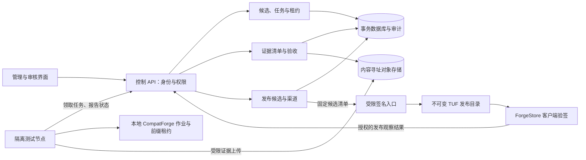

# ForgeOS 统一适配与市场服务端设计

状态：设计稿。用户已确认范围为统一管理适配任务、测试证据和市场发布；架构尚未进入服务端实现或外部部署。
日期：2026-09-30；更新：2026-10-02。首批目标：1000 个独立 Windows 应用。

## 目标与现状

把当前 JSON 台账、隔离虚拟机测试、CompatForge 本地作业和 ForgeStore 签名候选发布接成可追溯流程。当前验收并本地上架 12 款；安装成功、窗口出现、代码测试通过均不能算完成。保留当前 candidate-v12、元数据版本 21 和已有可信根，首阶段不迁移签名私钥、不重新初始化 TUF 信任。

服务端管理任务与证据，节点实际执行安装和功能测试，ForgeStore 客户端继续验证签名。服务端不会根据心跳、退出码或截图自行宣布 GUI 通过。GUI 验收要绑定操作步骤、预期结果、文件内容/CRC 和具体测试环境，并由授权验收者签署结果。

## 方案选择

| 方案 | 优点 | 代价 | 结论 |
| --- | --- | --- | --- |
| 一个服务端程序，内部划分调度、证据、发布模块；独立测试节点和签名入口 | 容易部署，状态与审计可在同一事务更新，方便逐步替换台账 | 单个程序的权限边界需要明确 | 推荐首阶段 |
| 调度、证据、发布分别做微服务并增加消息队列 | 各自扩容、权限隔离更强 | 分布式事务、消息重复和故障恢复成本高 | 节点/团队规模增长后再拆 |
| 扩展现有本地守护进程，通过共享目录维护队列 | 接入最快 | 跨节点租约、审计和发布一致性难保证 | 保留为单机开发模式 |

推荐沿用项目 Rust 技术体系。关系数据库采用 PostgreSQL，存任务、租约、状态和审计；大文件放兼容 S3 的对象存储，开发时可以本地内容寻址目录代替。队列先使用数据库事务领取，暂不增加单独消息中间件。API 框架、数据库驱动、对象存储产品及版本在实现计划中固定，设计稿不声称它们已经安装或可用。

## 组件与数据流

测试节点仅向服务端发起认证连接，服务端不开放任意远程 shell 或桌面输入接口。每个任务绑定应用 ID、固定版本、安装包 SHA-256、Recipe 摘要、Runtime Pack 摘要、VM 镜像标识、平台和验收用例版本。节点只执行已经评审的类型化动作。

## 状态、完成口径与取消

业务状态分别记录：候选来源待核对、来源许可已核对、包已固定、安装通过、功能验收通过、待签名候选、已签名、发布待观察、已发布验证、失败/阻塞。它们不能被一个 completed 字段混在一起。应用数量按 applicationId 去重，只统计完成签名、客户端发布验证和 GUI 功能验收的应用；新版本和重复重测不会增加独立应用数量。

执行尝试状态为 queued → preparing → running → cleaning → succeeded/failed/cancelled；不确定的运行节点或清理结果进入 quarantined。请求取消首先记录 cancel_requested，随后由执行节点停止辅助进程、安装器和 wineserver，确认清理后才提交 cancelled。准备到安装器启动之间共用取消状态与启动锁；cancel_requested 之后禁止新的启动。服务关停也必须走同一回收路径。

节点心跳过期只证明联系中断，不证明进程已停止。租约过期后隔离该执行环境；在节点确认旧任务结束或虚拟机重建并核对新的启动标识前，不把同一环境派给另一任务。fencing token 防止旧节点继续提交结果，但不能替代宿主上的进程和前缀租约。领取采用短事务与租约 CAS；安装过程中不持有数据库事务。

每个重试生成新的 attemptId，保留原始失败。重复提交由幂等键返回原任务。事件带 attemptId、递增序号和 fencing token，拒绝越序状态转换、旧租约写入和终态被覆盖。网络重试不能重复激活安装器。

## 数据模型

| 实体 | 核心字段与约束 |
| --- | --- |
| Application | 稳定 applicationId、发行者、来源、许可、独立应用计数身份 |
| ReleaseArtifact | 应用/版本/架构、官方固定 URL、许可证据摘要、SHA-256、长度、核对状态 |
| ReviewedRecipe | 不可变 Recipe 摘要、固定参数、appearance profile、所需能力和权限 |
| TestPlan | 用例版本、真实功能步骤、预期文件摘要/CRC、必需 GUI 检查 |
| Task/Attempt | 幂等键、执行状态、节点、fencing token、环境摘要、取消原因、清理结果 |
| EvidenceManifest | 安装/启动作业 ID、步骤结果、对象摘要、时间、操作者/节点身份、证据类型 |
| Acceptance | 精确 artifact/recipe/runtime/test-plan 摘要、审核者、通过项、限制与拒绝原因 |
| Publication | 渠道、目标清单摘要、候选版本、TUF 元数据版本、可信根标识、签名与观察状态 |
| AuditEvent | 主体、动作、对象、前后状态摘要、关联请求 ID；追加记录 |

源文件哈希与安装包哈希分开存储。GUI 截图、日志、测试文件和机器测试报告分开标注，不能把截图当成字节比较结果。证据与验收记录不可覆写；纠正错误时新增替代记录并引用原始记录。

上传许可中的摘要和长度只是声明。上传完成后，服务端必须读取实际对象重算 SHA-256、核对长度和类型，再把对象冻结为不可变内容寻址记录。未完成校验、可被覆盖或缺失的对象不能被 EvidenceManifest 或 Acceptance 引用；替换、校验失败和上传过期均保留审计记录。

## API 草案

| API | 作用 |
| --- | --- |
| POST /v1/candidates | 导入候选；不赋予验收或发布资格 |
| POST /v1/tasks | 以固定 TestPlan/Recipe/Artifact 创建任务，必须带幂等键 |
| POST /v1/nodes/claim | 按节点能力领取任务并获得有期限租约和 fencing token |
| POST /v1/attempts/{id}/events | 批量追加有序事件，带租约 token |
| POST /v1/attempts/{id}/cancel | 幂等请求取消；清理未确认时不返回已取消 |
| POST /v1/evidence/uploads | 为限定长度、摘要和媒体类型的对象创建受限上传许可 |
| POST /v1/acceptances | 授权验收者提交或拒绝固定证据清单 |
| POST /v1/publications | 由已验收目标生成不可变签名候选清单 |
| POST /v1/publications/{id}/observations | 上传客户端验签、更新/回滚和重启观察证据 |
| GET /v1/progress | 返回按状态拆分的数量和失败/阻塞，支持按平台与来源筛选 |

这些是协议设计，不是已可访问的端点。分页、对象数量、日志大小和请求体均应设明确上限。错误返回稳定错误码、关联 ID 和可重试标志，不返回环境变量、私钥或完整宿主路径。

## 身份、权限与隐私

角色包括候选维护者、测试节点、验收者、发布者和签名操作者。测试节点只能领取适合自身的固定任务和上传自身证据，不能改验收、渠道或 Recipe。发布者可以准备候选，签名入口只接收摘要固定的清单并重新核对验收约束。生产策略要求验收和签名权限分离。

节点使用可撤销的独立凭据，传输使用 TLS；具体证书发行与管理环境在部署方案中确定。测试桌面密码留在节点的凭据设施，服务端只保存 secret reference。签名私钥留在受限签名主机或后续硬件密钥设施，不进应用数据库、对象存储、Git 或日志。

证据仅上传任务专用测试目录中的允许文件。默认不上传用户文档、完整注册表、环境转储和桌面外内容。日志采用允许字段列表并做秘密检测。官方安装包可公开再分发的许可未核对前，缓存保持私有；客户端仍可从许可允许的官方 URL 下载固定包。

## TUF 发布与回滚

保持已有可信根，候选构建只增加符合许可与验收条件的目标。签名目标包括目录、验收收据和内容摘要。各角色版本递增；发布新版本只在不可变目录完成签名与自验后切换渠道指针。客户端下载完整一致的一组元数据，继续执行现有验签、期限和防回滚检查。

同一 TUF 仓库的版本分配和激活串行执行，数据库以唯一版本约束和 CAS 绑定前一发布摘要；不同渠道共用一个仓库时也不能分别分配角色版本。先冻结候选并记录发布意图，再完成签名和仓库写入、自验，最后以渠道指针的旧摘要为条件切换。每一步带幂等 publicationId；数据库与对象存储之间用持久化 outbox 和恢复扫描协调。崩溃后先核对实际不可变目录、签名与渠道指针再补齐状态，不能因请求超时重新分配较低版本或把未观察到的激活记为成功。CAS 冲突保留候选并重新核对当前发布，不覆盖另一个发布者的结果。

发布观察包含实际客户端验签、缓存安装/更新、选中 generation、真实功能重开和回滚结果。只有观察通过才变为已发布验证。失败时保留候选并解除其渠道激活资格；不得删除失败记录或降低元数据版本。业务内容回退通过新的、更高版本签名发布重新引用经验证的旧内容，不能把旧元数据版本覆盖到当前渠道。

## 首阶段实施与验收

1. 导入现有 12 个已验收条目和 11 个未完成条目，逐条校验证据引用。先只读展示，生成差异清单；不把已有 JSON 自动升级为服务器认证结果。
2. 接通一个隔离节点，复用 CompatForge 作业与清理所有者。通过重复领取、取消、断网、进程异常、服务重启和租约过期测试。
3. 接入不可变证据清单及验收权限；对缺少 GUI 步骤、SHA/CRC 不一致和证据被替换的情况拒绝验收。
4. 接通候选生成和受限签名入口，以本地实验渠道验证元数据一致性、更新与回滚；现有根不变。
5. 用 PeaZip 或下一款通过项跑完整路径，再迁移日常滚动流程。节点数由实测单机内存、磁盘和 GUI 并发能力决定，1000 是应用累计目标，不能直接转成 1000 个并发安装。

验收门槛：任务重复请求只产生一个 attempt；旧租约不能覆盖结果；取消/关停不启动后续安装器；清理失败保持隔离；缺少功能证据不签名；客户端拒绝篡改目标和过期元数据；签名失败不切换渠道；统计不因重复版本或重测增加。

## 待定部署参数

部署地点（现有构建主机、内网服务器或云）、访问主体、首批节点数量、对象容量与证据保留期、生产证书设施、签名审批方式以及备份/恢复目标尚未指定。这些不影响本设计的数据与生命周期边界。服务端实现前需把部署参数和上述架构纳入实施计划；本轮只交付设计，不自动购买资源或对公网部署。

参考：[现有 Windows 适配流程](../windows-rolling-adaptation.md)、[当前进度](../windows-1000-progress.json)、[TUF 角色与元数据](https://theupdateframework.io/docs/metadata/)、[PostgreSQL 锁与事务机制](https://www.postgresql.org/docs/current/explicit-locking.html)。数据库队列采用短事务的设计取舍是本项目方案，不是外部文档对本项目的性能保证。
