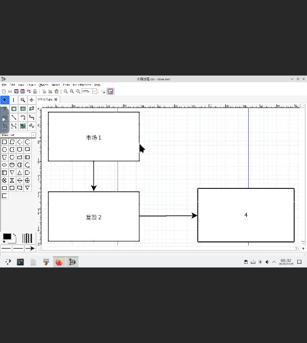
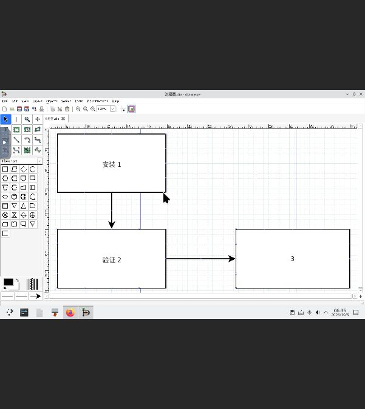

# Windows 滚动适配：Dia 0.97.2-2（2026-10-05）

本轮完成 Dia 固定安装包与许可核对、托管 NSIS 安装、中文原生流程图打开/增添节点与连线/另存/导出 SVG/新进程重开，以及签名本地市场更新、回退重开和 Core/Store 重启。累计 **21 / 1000 款独立 Windows 应用**。candidate-v21 有 23 项，包含两项不计数的内部夹具；原有 20 个通过项和 11 个阻塞候选完整保留，OpenSCAD 中文 STL 文件名问题未计为通过。

[官方主页](https://dia-installer.de/)提供 Windows 安装版本 0.97.2-2；[固定 SourceForge 安装包](https://downloads.sourceforge.net/project/dia-installer/dia-win32-installer/0.97.2/dia-setup-0.97.2-2-unsigned.exe)为 19,620,143 字节，SHA-256 `8257389d6264742d414404beaaaac869336c91f9f9af1e31ee081aa6e7857f3c`。实际下载跟随官方 SourceForge 镜像跳转，完整包的 SHA-1 `bf774bf6902e390d2a4ade45dde41f905c60ceeb` 与搜索服务返回的官方页面发布值一致。主页直接 TLS 抓取失败，记录已保留；未声称官方发布了相同 SHA-256。包名明确 unsigned，未验证 Authenticode。目录版本包含安装器修订后缀 -2，真实 About 显示主程序 **0.97.2**。

[固定 GNOME 源码归档](https://download.gnome.org/sources/dia/0.97/dia-0.97.2.tar.xz)为 5,507,004 字节，SHA-256 `a761478fb98697f71b00d3041d7c267f3db4b94fe33ac07c689cb89c4fe5eae1`。有界读取 COPYING、app/main.c、config.h.win32、installer/win32/dia.nsi、app/menus.c 与 app/commands.c 并记录各自哈希。主程序和安装器许可声明及真实 About License 支持 **GPL-2.0-or-later**；两代安装的 Dia/COPYING 均与固定源码 COPYING 逐字节一致：18,002 字节，SHA-256 `231f7edcc7352d7734a96eef0b8030f77982678c516876fcb81e25b32d68564c`。安装修订更新过基础库，完整捆绑组件源码/许可对应关系和再分发审计未完成。

原始托管安装 `job-1791178962804-6` 以 `/S /D=C:\Dia` 正常退出 0，代次 `gen-job-1791178962804-6` ready，观察到 2,231 个安装文件。未以手工解包替代安装。启动器 `Dia/bin/diaw.exe` 为 32 位 x86、24,576 字节，SHA-256 `4c38562afe57192c1a715b7749a4f3eb1581c6fe52e9122b79e8ccece1e5607e`，参数 `--integrated`。运行环境为现有 ForgeOS v12 隔离 KVM 测试机、Wine 11.14、C.UTF-8 与固定 Noto CJK 字体绑定，没有新增持久运行时修补或安全设置变更。

首次快速复合输入留下 insta/空文字、i1 和多余线等诊断内容；noVNC 左侧覆盖控件也曾截获工具点击。固定菜单源码确认 Ctrl+V 为对象粘贴，Ctrl+Shift+V 为 Paste Text，F2 为编辑文字。剪贴板到 Wine 的传播未被证明，直接中文键盘输入未验收。第一条连线起初只连接一端，两次输入夹具准备因此在写入前被断言拒绝；随后通过真实 GUI 拖动末端到第二节点中心，独立原生 XML 检查确认双端连接。上述诊断文件保留，不充当验收输出。

受控 **input/流程图.dia** 是测试台合成输入：从 GUI 诊断图中保留两个实际节点和一条双端连接线，移除多余诊断线，设置“安装 1”“验证 2”两个中文输入标签。它不是 GUI 生成的验收输出。真实 GUI 作业 `job-1791179045727-7` 打开该中文文件，通过工具创建第三个框、F2 输入单字符 **3**、L 工具增加第二条双端连接线，在原生 GTK 选择器另存 **output/流程图.dia**，通过 File > Export 保存 **output/流程图.svg**。输入字节保持，验收输出均由 Dia GUI 写出。

独立解压/解析原生图确认五个对象：三个 Flowchart Box、两条 Standard Line，文字为“安装 1”“验证 2”“3”；两条边的 handle 0/1 都绑定到节点，方向依次 1→2→3。前两个框的文字、坐标与尺寸保持输入值。SVG XML 包含三段对应文字、六个矩形（填充与轮廓）、两条线及四个箭头多边形；三个框的坐标/宽高均等于原生尺寸乘 20，容差 0.002；无脚本或外部图片。没有执行外部 SVG 查看器渲染或像素对比。新进程 `job-1791180565023-8` 显式从原生文件列表打开保存的中文 .dia 文件，观察三个节点和两条箭头，再正常退出 0，全部输入/输出哈希保持。

| GUI 输出 | 字节数 | SHA-256 |
| --- | ---: | --- |
| 原始 output/流程图.dia | 1086 | `27e9acda86813356fe0f82a62cec9de2f495c7489d37be8ffefe33a6a640f960` |
| 原始 output/流程图.svg | 2327 | `6ba2084f20f51bed5c244481b7b9301520776bc9df46551d6f58fdf1b5d0d7d4` |
| 更新 output/市场流程.dia | 1110 | `53de8ee75dd0e26b264388a05f85b48d23366ef98cee8a6a78b1580405364d97` |
| 更新 output/市场流程.svg | 2367 | `ea60e3a08517dccc3a198e0c87b4a3f8272e81ad01f07556fcbccb077a2d5e12` |

原始收据冻结为 SHA-256 `e464bb946aca446bbf590b3db7cdb884baaaf93c7f5d12b9e30c2235e6a0d185`，后续市场生命周期另记。candidate-v21 保留 root 1，timestamp/snapshot/targets 正常推进至 **30**，到期 2026-10-29。tuftool 0.17 使用 v20 可信根实际 `download` 验证 catalogue.json 和 Dia 收据返回 0；旧签名目标 pin 保持。25 个公开签名文件上传后逐字节核对，实际市场服务激活为 23 项；激活前 158 个完整 Core 作业、57 条完整 Store 数据库记录及旧市场条目/已安装项不变，没有重置信任状态。

市场更新 `69fc3dd4-08a6-4c4c-b1ec-08f4fac429b7` 成功，实际 Core 安装作业 `job-1791181511958-9` 创建第二个 ready 代次 `gen-job-1791181511958-9`。使用完整哈希核对的安装器缓存，这是同版本重装，没有声称客户机在线下载或跨版本升级。新代次 ForgeQA 原先不存在，输入 **input/市场流程.dia** 由受控输入改为“市场 1”“复验 2”合成，968 字节，SHA-256 `0cdfb74eaf7ddf37cb6934bcdb9086bcdd78f769aaee2ec4240033379ff74b23`；两项新输出在 GUI 前不存在。

更新代 GUI `job-1791181578508-10` 打开新的中文输入、创建第三节点 **4** 及第二条双端连接线、另存原生文件并导出 SVG，正常退出 0。独立检查再次通过五对象、两个完整附着边、中文标签保持与 SVG 三个框乘 20 的几何对应。新进程 `job-1791181850769-11` 显式重开实际 .dia 文件并正常退出 0。最初目录路径请求产生原生 Could not open 错误，重新打开文件选择器后选择可见 .dia 文件成功；保留失败截图，不据此断言 Dia 缺陷。一次 Ctrl+E 在连线仍选中时只适配了该线，730% 截图作为诊断；验收证明来自无选中对象的新进程重开，完整图为 170%。

市场回退 `f21012f7-8501-46f1-8372-925aa4c1ec28` 成功，选择回原始代次，两个 ready 代次都保留。回退只改变代次选择，不提交额外 Core 作业；测试台最初对 Core 任务数的错误预期被只读差异检查纠正，历史任务/Store 行/配置/信任/服务约束均未变化。`job-1791182045754-12` 在回退代显式打开原始 **output/流程图.dia**，原有中文标签及第三节点 3 可见，正常退出 0。两代所有输入、原生图、SVG 和诊断文件哈希保持。

Core/Store 重启后，**162 个完整终态 Core 作业、59 条完整 Store 数据库记录、市场目录/已安装项、代次/选择、全部 Core 配置与服务约束一致**；本轮前 155 个 Core 作业和 57 条完整 Store 记录逐条保持。新增七个 Core 作业全部成功退出 0，两项 Store 更新/回退成功。59 条规范 JSON 市场记录 SHA-256 `04819c9323cce1f2f02a82f18c79a4d8a2a8f66add8bdf03932f179740818602`。运行二进制仍为 Core managed-MSI-v10 与 Store managed-MSI-v2；Store 的 NoNewPrivileges=yes、ProtectSystem=full、PrivateTmp=yes 保持。Core 原有约束行没有变化，不宣称新增了这些约束。

可信根 SHA-256 `345053af51944c6ad56e4d5ac79c65be0b31b515befcc160fe5d226c6a027d0e` 始终相同；25 个目录源文件逐字节保持，缓存完整信任文档与签名在重启前后相同，不对缓存序列化字节作断言。latestKnownTime 从 `2026-10-05T06:25:01.610986691Z` 单调推进至 `2026-10-05T06:36:45.796420802Z`。两项服务 readiness 均首轮通过。自动锁屏后使用既有授权账户登录，未移除密码或改变认证。密码、签名密钥、安装包与完整私有快照均不入库。

本轮验收限于受控中文输入的流程图文件工作流、缓存同版本更新、回退及服务重启。直接中文键入/剪贴板、外部 SVG 渲染、复杂形状/其他格式/打印、既有用户数据迁移、全新机器注册、客户机在线下载、跨版本升级、远端安装包再分发、完整组件源码审计、Authenticode 和可复现构建未验证。没有新增 Core/Store 或应用行为代码修补。

本轮运行 `python -m unittest discover -s tests -v`：四项通过，一项因需要 Linux ForgeOS package tool 跳过。最终有界复核同时确认旧 20 个通过项/11 个阻塞项、旧 v20 字节、25 个新签名 JSON pin、冻结收据、九张实际 JPEG 与报告链接一致；两代实际文件经严格 SSH 只读取回私有缓存，再次独立解析原生对象/连接与 SVG 文字/几何通过。入库范围只有目录 JSON、文档和实际截图。

证据入口：[固定来源与许可](evidence/2026-10-05-dia-source.json)、[配方](evidence/2026-10-05-dia-recipe.json)、[原始收据](evidence/windows-dia-20261005.acceptance.json)、[原始后端验收](evidence/2026-10-05-dia-backend.json)、[市场生命周期](evidence/2026-10-05-dia-publication.json)、[失败记录](evidence/2026-10-05-dia-failures.json)、[累计台账](windows-1000-progress.json)。

