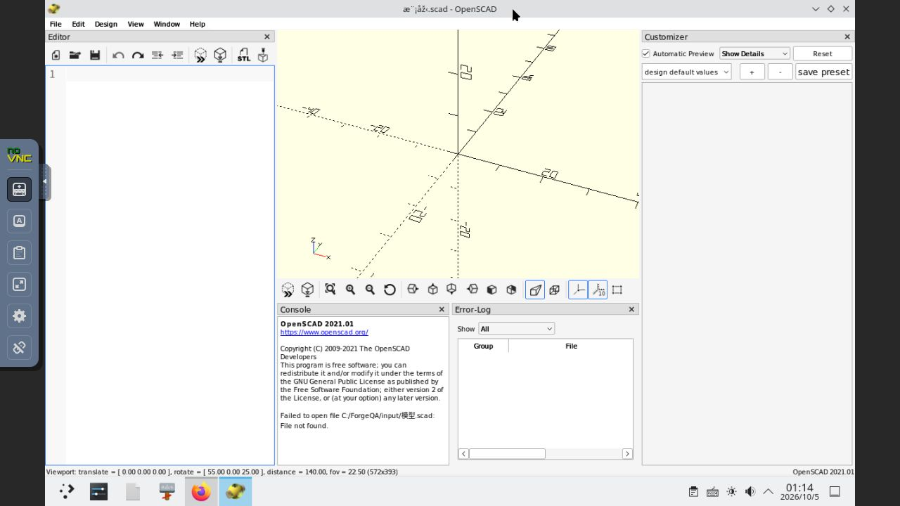
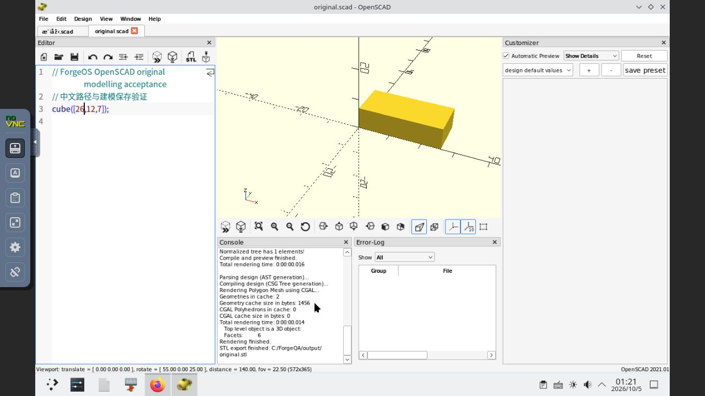
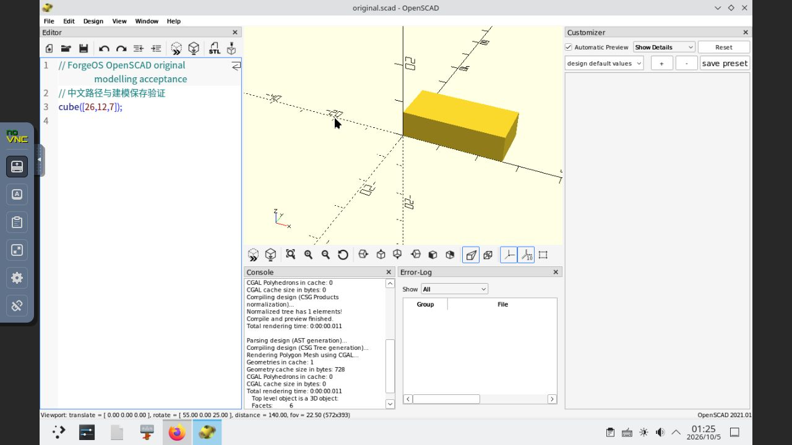

# Windows 滚动适配：OpenSCAD 的 ASCII 路径流程通过，中文文件名阻塞（2026-10-05）

**累计仍为 20 / 1000。** OpenSCAD 2021.01 已安装，本轮真实 GUI 验证了 ASCII 文件名下的读取、编辑、保存、CGAL 渲染、STL 导出及新进程重开。原定中文文件名读取失败，尚未完成全部 GUI 验收，没有签名、上架或计入完成。11 项阻塞队列保留，活动市场仍为 candidate-v20、可信根版本 1、角色版本 29。

## 已观察的功能与失败

通过可见的原生文件列表打开 `C:\ForgeQA\input\模型.scad`，窗口标题出现乱码，编辑器为空，控制台报告 `Failed to open file C:/ForgeQA/input/模型.scad: File not found.`。输入文件实际存在，UTF-8、104 字节，SHA-256 为 `6f123b4af0ddef990e3c0bfcb6a8b5e98ae444c9d15a2ede5eafc229a29e583e`；原内容为中文注释和 `cube([18,12,7]);`。此操作使用文件列表选择，排除了输入路径时的丢字或标点错误。

只改变单次启动环境 `QT_QPA_PLATFORM=windows:dialogs=none` 后重复中文文件选择，仍报告相同错误。Core 启动计划与实际原生进程环境均已核对这个参数。该探测没有解决问题，没有写入持久应用定义、recipe 或服务环境。实际对话框外观仍类似原生窗口，不根据参数存在推断对话框实现已成功改变。

为隔离文件内容与文件名，后台仅复制原始输入字节到 `input/model-control.scad`；两个输入的长度与摘要完全相同，没有后台生成模型输出。在上述临时探测进程中，ASCII 文件名可以正常读取，中文注释显示正常。通过 GUI 将模型宽度从 18 修改为 26，保存为 `output/original.scad`，按 F6 完成 CGAL 渲染，并导出 `output/original.stl`。About 实际显示 OpenSCAD 2021.01 和 GPL version 2 或用户选择的更高版本。

关闭探测进程后，使用没有 Qt 覆盖参数的新进程，从文件列表明确重开保存的 `original.scad`。中文注释和 `cube([26,12,7]);` 保持，F6 再次得到 3D 对象、6 个面。随后关闭窗口；三个托管 GUI 作业均正常结束，Unix Wine 退出 0。退出成功仅代表进程正常结束，不能代替功能验收。

## 独立输出校验

校验只读取 GUI 实际创建的文件，没有使用 CLI 渲染或生成替代输出。

| 输出 | 字节数 | SHA-256 | 校验结果 |
| --- | ---: | --- | --- |
| `output/original.scad` | 107 | `3183d8b67e54d5a376765acbfaab98fe3b9e842d0105b5e420789b263ea6679a` | UTF-8 中文注释保留；规范化 CRLF 后仅宽度 18→26 |
| `output/original.stl` | 684 | `df51f268b798cff3350f45a3bdf6bc6e6eca3e4e6302cf0efa5b692518969101` | 二进制 STL，12 个三角面、8 个顶点、18 条无向边，每条边关联两个面，Euler 特征数 2 |

STL 包围盒为 `(0,0,0)` 至 `(26,12,7)`，计算体积 2184；所有坐标有限。新进程重开后，两份输入及两份输出长度和摘要均不变。

## 环境恢复与诊断边界

本轮支持的浏览器控制恢复可用。开始时 noVNC 无法连接且本机 6096 没有监听；恢复了仅绑定 localhost 的严格 SSH 转发，页面可连接。实际测试桌面已解锁，没有移除密码、修改认证或将密码写入文件。存活的 VM、Core 和 Store 本轮没有重启。

整段远程文字输入存在传输问题，输入路径时出现错误标点，粘贴没有进入文件名栏；使用相对斜线的保存路径还被原生对话框拒绝。改为可见文件列表和目录导航后继续测试。这些输入及原生路径格式错误与两次真实中文文件列表读取失败分别记录，旧工具网址识别失败也保留在[旧报告](windows-rolling-20261003-openscad-pending.md)中。

固定源码 [UIUtils.cc](https://raw.githubusercontent.com/openscad/openscad/41f58fe57c03457a3a8b4dc541ef5654ec3e8c78/src/UIUtils.cc) 与 [tabmanager.cc](https://raw.githubusercontent.com/openscad/openscad/41f58fe57c03457a3a8b4dc541ef5654ec3e8c78/src/tabmanager.cc) 用于有界路径读取诊断，完整文件长度和摘要已记录。首次 `src/TabManager.cc` 大小写错误的只读查找失败保留，之后按实际源码树改为 `src/tabmanager.cc`。文件名编码或 Wine/Qt 交互仍是假设，尚未证明精确根因，没有宣称修复成功。

## 状态保留与下一步

Core 共 153 条终态作业，原有完整 150 条逐条不变；新增作业为 `job-1791162501179-1`、`job-1791163079427-2`、`job-1791163425220-3`。57 条完整 Store 记录、市场 snapshot、完整 TUF 信任文档及签名、所有原 Core 配置摘要、全部代次与服务约束均不变；最新已知时间单调。candidate-v20 的 24 个签名文件与提交前 Git 原字节一致，可信根摘要仍为 `345053af51944c6ad56e4d5ac79c65be0b31b515befcc160fe5d226c6a027d0e`。Launcher 和两份 JPEGView 输入 pin 保持。

下一步需定位并修复中文文件名读取，再用原始中文输入复测并验证中文保存/导出范围；达到验收要求后才创建签名接受目标、执行本地市场更新及回滚验证。当前未进行 OpenSCAD 的这些市场操作。高级建模、打印、库工作流、完整组件许可/再分发、安装器与源码构建对应、Authenticode/GPG 和可复现构建均未验证。

所有本轮事实、作业事件、输出语义、七张原始截图的字节 pin 和状态保留断言见[本轮证据](evidence/2026-10-05-openscad-gui-pending.json)。截图 API 实际返回 JPEG；归档使用 `.jpg`，保持原始字节，无重编码或编辑。最初来源与安装证据保留原观察，不覆盖历史失败。
