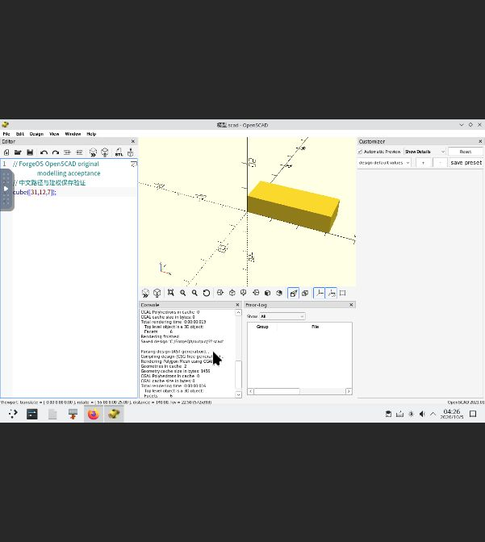
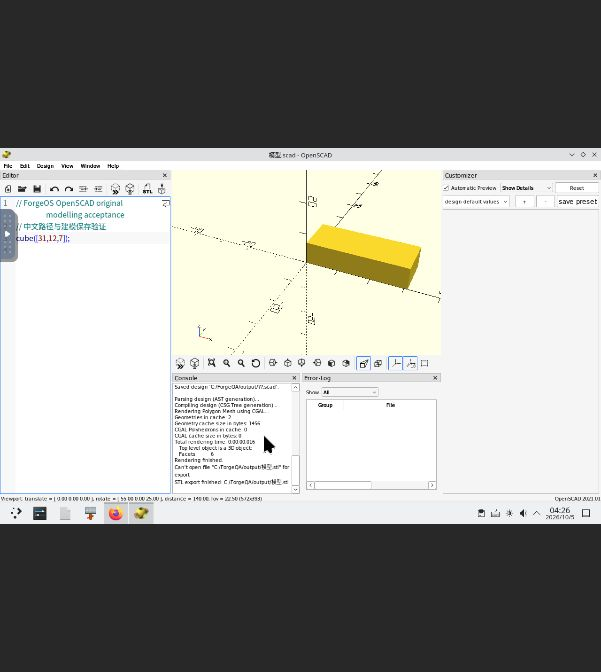
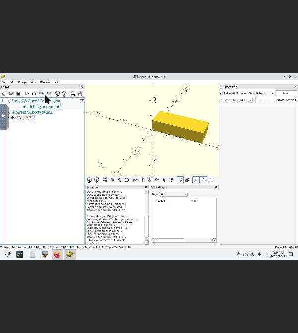

# Windows 滚动适配：OpenSCAD 中文读取与保存通过，中文 STL 名称阻塞

2026-10-05 下一轮。**累计仍为 20 / 1000，OpenSCAD 尚未完整验收、未上架。** 本轮将上一轮的“中文文件名读取失败”定位到启动页路径转换；主编辑器的中文读取、编辑、保存、F6 渲染及新进程重开通过。中文名称 STL 导出实际失败，不能用控制台的“export finished”计为通过。旧报告与失败证据保持原样。

## 路径边界与实测

固定 [src/openscad.cc](https://raw.githubusercontent.com/openscad/openscad/41f58fe57c03457a3a8b4dc541ef5654ec3e8c78/src/openscad.cc) 的启动页分支在 791 行调用 `f.toStdString()`，随后 `assemblePath` 在 648 行使用 `QString::fromLocal8Bit()` 解码。前者产生 UTF-8，后者采用本地编码。测试瓶注册表 ACP 记录为 1252；这不是直接调用运行进程的 GetACP()，没有宣称取得该 API 的实际返回值。

固定 [src/mainwin.cc](https://raw.githubusercontent.com/openscad/openscad/41f58fe57c03457a3a8b4dc541ef5654ec3e8c78/src/mainwin.cc) 的 `actionOpen()` 则从 `UIUtils::openFiles()` 直接把 QString 路径传给 TabManager。本轮正常环境启动后先点 New，再用主编辑器 File/Open 的真实文件列表选择**同一原始** `C:\ForgeQA\input\模型.scad`：文件名正确，中文注释和 `cube([18,12,7]);` 均加载，F6 渲染通过。与启动页乱码、空编辑器和 File not found 的失败形成对照。

通过 GUI 把宽度 18 改为 31，另存到 `C:\ForgeQA\output\模型.scad`，保留对话框预填的中文文件名。独立读取证实实际文件存在，UTF-8 中文注释保持，规范化 CRLF 后仅模型宽度改变。GUI F6 再渲染通过，原输入没有改写。

## 导出不能只看完成消息

使用 GUI Export as STL，保留预填的 `模型.stl` 并提交。控制台先报告无法打开文件进行导出，随后仍打印 `STL export finished`。独立校验发现预期 `output/模型.stl` **不存在**，首次验证脚本因此以 FileNotFoundError 停止，没有提前提交下一作业。失败及截图保留，后续记录负结果。

固定 `mainwin.cc` 的 `makeExportInfo` 在 1943 行将 `name2open` 设置为 `exportFilename.toLocal8Bit()`，而显示名称采用 UTF-8。此单字节路径边界与观察到的中文名称失败、ASCII 名称成功相符；未捕获失败原生打开调用的实际路径字节，不将替代字符的具体内容当作实测结果。

## 自动进入编辑器的单项探测

关闭正常进程后，新托管作业仅增加一个**空的文件名位置参数**：`argumentOverrides: [""]`。计划参数已核对；Qt、locale 和 registry 均未覆盖。程序直接进入空白编辑器，没有再次出现启动页，符合固定源码 `inputFiles.size()` 对启动页的控制逻辑。

在新进程中从真实文件列表明确重开 `output/模型.scad`，中文注释、文件名与 `cube([31,12,7]);` 均保持，F6 渲染通过；随后以 ASCII 名称 `reopened31.stl` 导出。该参数是**成功的临时诊断绕行**，尚未写入应用定义、安装代次或正式启动器；中文 STL 名称问题仍未修复。

| GUI 输出 | 字节数 | SHA-256 | 独立结果 |
| --- | ---: | --- | --- |
| `output/模型.scad` | 107 | `88d3f5c24b65a1e56d6a44e914c39a7cdbb3665fd3301adb1aa0899f5d102fe6` | UTF-8 中文保留，仅宽度 18→31；新进程读取并渲染 |
| `output/reopened31.stl` | 684 | `c9757151b86d8fd6674478526b3963a3856789cd3e8b6bd76eeb70ffda073149` | 二进制 STL：12 三角面、8 顶点、18 边，每边关联两个面，Euler 特征数 2 |
| `output/模型.stl` | — | — | 导出失败；文件不存在 |

有效 STL 包围盒 `(0,0,0)` 至 `(31,12,7)`，体积 2604，坐标有限。验证仅读取 GUI 创建的文件，没有后台生成替代输出。两份原输入及上一轮两份 ASCII 输出 pin 均保持。

## UTF-8 修复研究与状态保留

Wine 11.14 的 [ntdll/locale.c](https://raw.githubusercontent.com/wine-mirror/wine/wine-11.14/dlls/ntdll/locale.c) 支持 activation context 的 `activeCodePage=UTF-8`；[actctx.c](https://raw.githubusercontent.com/wine-mirror/wine/wine-11.14/dlls/ntdll/actctx.c) 在已有内嵌 manifest 时先使用资源。实际 PE resource tree 解析找到 `24/1/1033`、1206 字节的 manifest，SHA-256 为 `197004129be1c6918a24c2e8b48506f3f59825275ff6ecd1b4c3cdab4b408056`，其中没有 activeCodePage。因此未盲目添加旁置 manifest，也没有修改官方 exe、代码页注册表、系统 locale 或运行时。上游源码与当前运行时构建对应关系仍未审计。

正常作业 `job-1791174125576-4` 与空参数探测 `job-1791174865851-5` 均正常关闭、Unix Wine 退出 0；进程退出不等于完整 GUI 验收。Core 共 **155 条终态**，上一轮完整 153 条不变；57 条 Store 记录、市场、完整 TUF 信任文档及签名、原 Core 配置摘要、全部代次、服务约束保持，最新已知时间单调。candidate-v20 的 24 个签名文件原字节保持，可信根摘要仍为 `345053af51944c6ad56e4d5ac79c65be0b31b515befcc160fe5d226c6a027d0e`。

下一步应以可复现的派生构建或受控适配机制修复路径编码，再验证默认启动、中文文件名导出及独立文件内容；单纯修改代码页登记值或增加被内嵌资源覆盖的旁置文件不构成修复。修复完整验证前不创建接受目标、不签名、不发布市场。高级格式、组件再分发及构建对应关系仍未验证。

本轮七张未编辑 JPEG 的长度/摘要、正常退出事件、原生输出及 STL 语义、源码 pin、历史失败引用见[本轮证据](evidence/2026-10-05-openscad-unicode-pending.json)。[上一轮报告](windows-rolling-20261005-openscad-pending.md)与[旧安装报告](windows-rolling-20261003-openscad-pending.md)保留原观察。测试 VM 自动锁屏后使用此前授权的现有凭据解锁，未更改或保存密码；无需重启存活系统。
