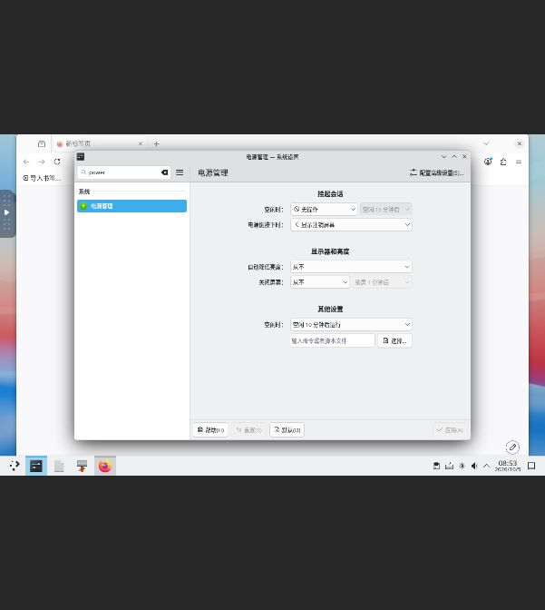
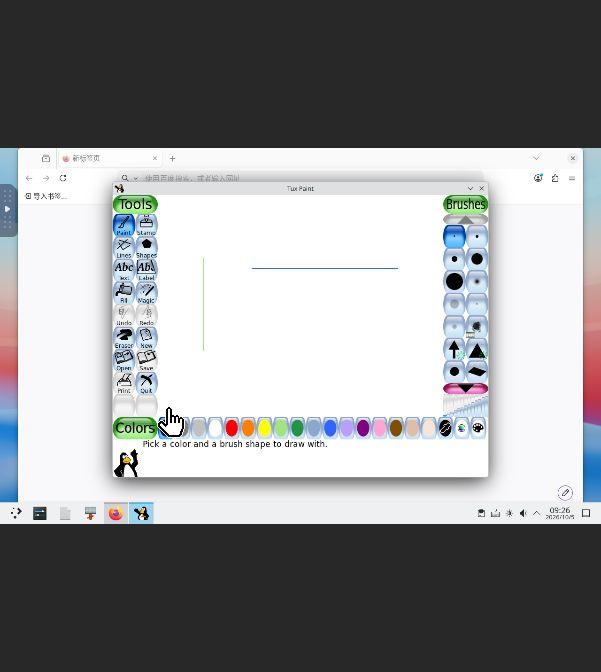

# Windows 滚动适配：Tux Paint 与禁止自动息屏（2026-10-05）

本轮 Tux Paint 0.9.35-3 完成固定安装包核对、配方修正、真实绘图保存与显式重开，以及实际本地市场激活、更新、回滚和 Core/Store 服务重启验收。累计 **22/1000 款独立 Windows 应用**，原有 **11 个阻塞候选**完整保留。不能把安装成功、窗口出现或目录签名成功单独计为完成。

测试环境为现有隔离 ForgeOS v12 x86_64 KVM 虚拟机、Wine 11.14 win64。此次没有修改生产 Core/Store 二进制。实际市场为 candidate-v22，TUF root 仍为 1，timestamp/snapshot/targets 为 31，到期时间仍为 2026-10-29T00:00:00Z；24 个目录条目由 22 款应用和 2 个夹具组成。

## 不自动息屏

依用户要求，在真实 KDE 系统设置的交流电源“显示”页将自动降低亮度、关闭屏幕均改为“从不”，点击应用后保存。此前分别为 5 分钟和 10 分钟。读回 `~/.config/powerdevilrc`：

```ini
[AC][Display]
DimDisplayIdleTimeoutSec=-1
DimDisplayWhenIdle=false
TurnOffDisplayIdleTimeoutSec=-1
TurnOffDisplayWhenIdle=false
```

当前测试机没有电池设备，因此验收范围是交流电源配置。关闭设置窗口、应用测试以及 Core/Store 服务重启后再次读回相同字节。普通闲置锁屏时桌面画面仍可见；自动锁屏和身份验证未修改，沿用既有授权登录继续测试，口令未写入仓库。此次没有重启整台虚拟机，也没有完成精确计时的长时间空闲试验。[设置记录](evidence/2026-10-05-no-screen-blanking.json) 保留这个限制。



## 来源、安装及修正

[官方 Windows 下载页](https://tuxpaint.org/download/windows/) 指向固定的 x86_64 安装包 `tuxpaint-0.9.35-3-windows-x86_64-installer.exe`，实际下载并核对 50,412,612 字节，SHA-256 为 `9d393d1c829ff9d74c1dff0c5726f47773a44c989bf0ce521d266f0a6fcf6c4c`。官方 SourceForge 镜像重定向已观察；这是本地计算的固定哈希，未声称匹配官方公布的 SHA-256。

[官方源码页](https://tuxpaint.org/download/source/) 对应的固定 0.9.35 源码中，`src/tuxpaint.c` 明示 GPL-2.0-or-later。安装后的主 `docs/COPYING.txt` 与源码同文件逐字节相同。安装包修订号为 0.9.35-3，启动画面显示 0.9.35 / 2026-02-09，stdout 原样为 `Tux Paint Version 0.9.35- x86_64 (2026-02-09)`；三者分开记录。未验证 Authenticode、可复现构建、全部捆绑组件许可/对应源码及修订 3 的完整源码对应。[来源证据](evidence/2026-10-05-tuxpaint-source.json) 包含固定源码文件和许可哈希。

首次配方使用 `/DIR=C:\TuxPaint` 并期望 `TuxPaint/tuxpaint.exe`。Inno 实际安装到 `Program Files/TuxPaint`；安装器退出 0，但 Core 提交代次因启动器不存在而失败，错误为 `registry I/O failed: No such file or directory (os error 2)`。固定源码的 `MyAppDir()`/`wpSelectDir` 目录赋值与此行为一致。修正配方去掉无效 `/DIR`，使用真实默认路径，然后执行全新托管安装。未移动安装文件或把失败代次改成成功。

| 阶段 | 实际任务/代次 | 结果 |
| --- | --- | --- |
| 首次安装 | job-1791190499337-1 / gen-job-1791190499337-1 | failed，完整保留 |
| 配方修正后新安装 | job-1791190704821-2 / gen-job-1791190704821-2 | succeeded / ready |
| 原代次绘图、显式重开 | job-1791190778738-3、job-1791191516109-4 | 正常退出 0 |
| 市场 update 新安装 | job-1791191897688-5 / gen-job-1791191897688-5 | succeeded / ready |
| 新代次绘图、显式重开 | job-1791191961455-6、job-1791192273561-7 | 正常退出 0 |
| 市场 rollback 后显式重开 | job-1791192543868-8 | 原成功代次，正常退出 0 |

实际 `tuxpaint.exe` 是 AMD64 PE，539,136 字节，SHA-256 `29d4bc7e902c5ce8c203c941e71b4e440e29cf469d88ec1c62bdf40c036e5344`；永久启动参数仅为 `--windowed`。[修正配方](evidence/2026-10-05-tuxpaint-recipe.json)、[失败记录](evidence/2026-10-05-tuxpaint-failures.json) 分开保留，不宣称 Core/运行时缺陷修复。

## 真实 GUI 文件流程

原成功代次在没有 Tux Paint 用户数据的情况下进入空白画布，手工画黑色 L 和红色横线，观察 Undo 后红线消失、Redo 后恢复，点击 Save 出现保存成功提示。应用实际创建原生时间戳命名 PNG；正常退出后由新的托管进程打开真实 Open 画廊，明确选择缩略图并打开，恢复完整绘图。再次正常退出，PNG 和缩略图字节保持不变。

更新代次同样从没有 Tux Paint 用户数据的独立安装开始，手工画浅绿色竖线和蓝色横线，Save、正常退出、新进程显式画廊 Open、正常退出均通过。最初误选 White 的白色横线及随后按实际 Blue 提示重绘的测试操作错误保留在失败记录；没有把它当作应用缺陷。

| 输出 | 原成功代次 | 市场更新代次 |
| --- | --- | --- |
| PNG | [原始绘图](evidence/2026-10-05-tuxpaint/original-drawing.png) | [独立新绘图](evidence/2026-10-05-tuxpaint/updated-drawing.png) |
| 原生文件名 | 20261005090145.png | 20261005092143.png |
| 字节 | 3019 | 3022 |
| 像素 | 608×472 RGB，Adam7 | 608×472 RGB，Adam7 |
| 非白像素 | 黑 1068、红 936 | 浅绿 594、蓝 936 |
| PNG SHA-256 | 13b90710899d4d1c9be97b1446d743000f1ded0ab62c8b6cd6e1b35d20c13322 | e54c7e2adb28a0e44a55033f72e1c00b029c8353f69f11887aa7729ee9a136b3 |

独立检查验证所有 PNG chunk CRC、七遍 Adam7 解码和全部 286,976 个 RGB 像素，对指定 3 像素笔划及白背景逐像素比较，两份输出均零差异；新版颜色值另外与固定源码 `src/colors.h` 核对。原图还经独立审查以 Pillow 解码复核。两份绘图及缩略图公开证据都是原生输出的原始字节副本，未由后台生成或编辑。仅验收这一受控 Paint/Undo/Redo/Save/Open PNG 流程；中文输入/文件名、其他工具、标签、印章、导出、打印及外部图像查看器未验证。



## 本地市场与重启

使用既有 root 1 签署 roles 31；`tuftool 0.17 download` 以之前 candidate-v21 的可信根验证 catalogue 和新验收目标，未使用不安全根下载/允许过期参数。新目录的 26 份公开签名 JSON 原始字节以及此前所有旧目标哈希保持不变。实际 Store 服务通过原安全隔离中的只读目录绑定激活 candidate-v22，随后通过真实 Unix API 完成 update 和 rollback。

- update：`62c01376-87ac-4904-9b33-bd0a56f55c38`，succeeded；使用核对后的安装包缓存进行同版本全新安装，不宣称来宾在线下载或跨版本升级。
- rollback：`10c888c5-348d-4850-9cca-d07d4fa3026b`，succeeded；恢复选择 `gen-job-1791190704821-2`，新进程通过画廊显式打开原始黑红绘图。回滚只改变选择，不创建新的 Core 安装任务。
- 最终 3 个 Tux Paint 代次中 2 个 ready、1 个 failed；失败及两份真实输出完整保留，不宣称用户数据迁移。
- Core 和 Store 分别重启，最终 170 个终态 Core 任务、61 个完整 Store SQLite 行；本轮之前的 162 个任务和 59 行逐条不变，其他应用全部配置字节及代次不变。
- 重启前后完整任务、SQLite 行、市场快照、配置、代次、安全设置和含签名 TUF 文档一致，latest-known-time 单调。root SHA-256 仍为 `345053af51944c6ad56e4d5ac79c65be0b31b515befcc160fe5d226c6a027d0e`。

Core 使用既有 managed-msi-v10 二进制，Store 使用既有 managed-msi-v2，哈希均未变。Store 的 `NoNewPrivileges=yes`、`ProtectSystem=full`、`PrivateTmp=yes` 保持；Core 原先这些显式设置为空，未把 Store 的保护误称为 Core 已有保护。签名私钥、登录口令、安装包和完整私有前后快照均不入库。

[原 GUI 验收](evidence/2026-10-05-tuxpaint-backend.json)、[冻结的签名验收收据](evidence/windows-tuxpaint-20261005.acceptance.json)、[实际市场生命周期与重启记录](evidence/2026-10-05-tuxpaint-publication.json)、[累计台账](windows-1000-progress.json) 对应上述计数。新机器配方注册、远程公开安装包分发、全部源码/再分发审核仍未验证。

提交前还核对了台账与旧 21 项/11 个阻塞项的完整保留、26 份签名 JSON 的磁盘字节和哈希、验证下载与冻结收据的一致性、所有真实截图/原生 PNG 副本、报告链接及新增文本的口令/私钥/令牌扫描。Python 单元检查 4 项通过，1 项依赖 Linux ForgeOS 包工具而跳过；未声称该跳过项已测试。本轮真实来宾验收独立于这些单元检查。

独立最终审查未发现 Important/Critical 问题：以 Pillow 对更新 PNG 再次逐像素验证零差异，核对全部原始图片与两代输出，并独立检查 root 1 的 RSA-PSS 阈值、v31 三角色元数据链、21 个公开 JSON 目标的摘要及旧 v21 原始字节。审查同时确认 22 项台账、旧 11 个阻塞候选、失败代次与电源/锁屏边界一致。
