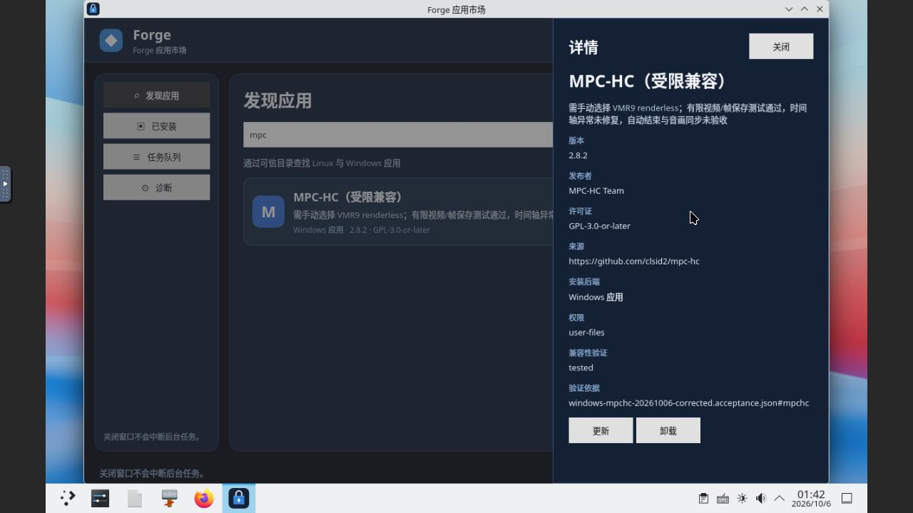

# Windows 滚动适配：MPC-HC 2.8.2（受限兼容）

本轮增加一个经过真实文件工作流和本地市场生命周期验证的独立 Windows 应用，累计 **23/1000**。MPC-HC 只在手动选择 VMR9 renderless 后通过有限视频与帧保存验收；时间轴问题仍在，不代表播放器全部功能通过。市场列表和详情直接展示配置要求与限制。

## 来源与安装

采用 [clsid2 官方固定发布 2.8.2](https://github.com/clsid2/mpc-hc/releases/tag/2.8.2) 的 `MPC-HC.2.8.2.x64.exe`，22986429 字节，SHA-256 `4a39ff780905c533f43b7e5684672a50345369b54e895e2ca6b7039194490d12`，与官方 GitHub 资产摘要一致。GUI About 显示 `2.8.2 (a84d0cf38)`，对应固定源码提交 `a84d0cf38a1866f3518bb819c901300dacff5a9b`。

固定核心源码 `mplayerc.cpp` 明确允许 GPL v3 或更高版本，许可字段已核对为 `GPL-3.0-or-later`。已安装 COPYING 与固定源码字节一致；完整组件许可/源码闭包、Authenticode 和可重复构建未验收。参考 [来源记录](evidence/2026-10-06-mpchc-source.json) 与 [安装配方](evidence/2026-10-06-mpchc-recipe.json)。

原安装任务 `job-1791248844496-1` 成功，选中代次 `gen-job-1791248844496-1`。AMD64 启动器摘要为 `cb5a1ca49e9bcb237ec0b7d9fddc8c8f8f07ad749ee954c4e407089ad2df4c95`。测试运行于原 ForgeOS v12 / Wine 11.14 环境。

## 真实功能与失败

默认视频渲染器加载失败。选择应用自带基础回退后能播放中文文件名视频，但两次 GUI Save Image 操作后，预期 PNG 均不存在。保留了失败截图及独立缺失文件检查；没有捕获模态错误，也不能排除错过短暂 OSD 提示。

在应用内选择 `Options > Playback > Output > Video Mixing Renderer 9 (renderless)` 后，中文视频可见播放、暂停和手动跳转，GUI 保存 640×360 PNG。独立解码对照最后十个源帧，最接近第 479 帧，平均 RGB 绝对差 0.8824、最大差 3。正常退出后，新管理进程通过实际打开对话框重开该 PNG。参考 [原代次后台记录](evidence/2026-10-06-mpchc-backend.json) 和 [播放器实际创建的原 PNG](evidence/2026-10-06-mpchc/player-created-vmr9.png)。输出副本未经编辑。

原视频约 20.04 秒，GUI 曾显示 `00:40 / 00:20`。这项时间轴问题未修复，不能视为已证明的纯显示错误。正确播放计时、自动结束、音画同步和精确跳转均未验收；物理声音、字幕、HDR、硬件加速及网络播放也未验收。配方没有自动设置渲染器，每个新安装代次需要手动配置。全部失败与证明更正见 [失败记录](evidence/2026-10-06-mpchc-failures.json)。

## 本地市场生命周期

通过真实 Store 更新任务 `938c7ace-ba80-44f3-ba34-91ad89c3ee5f`，从校验后的安装包缓存创建独立代次 `gen-job-1791250002939-4`。原代次设置未复制，新代次通过 GUI 手动选择 VMR9。

使用独立生成的中文文件名视频 `市场视频.avi`（约 12.04 秒，SHA-256 `0f37d42f35e6af437f3bd4a9ded800d1b803158717c6e7b658536f3ea648317b`）重复播放、暂停、跳转和 PNG 保存。保存图与第 222 帧最接近，在十个候选帧中平均 RGB 绝对差 0.8686、最大差 3。正常退出后的新进程重播视频，GUI Output 页仍显示 VMR9，随后明确打开已保存 PNG。参考 [市场代次 GUI 记录](evidence/2026-10-06-mpchc-market-gui.json) 和 [实际市场代次 PNG](evidence/2026-10-06-mpchc/player-created-market.png)。

Store 回滚任务 `0e4fd3ea-00e6-491b-8d64-376b9b03b7e2` 精确选择回原代次，新管理进程重新打开原 PNG。两个就绪代次、输入、输出、启动器及许可摘要均保留。Core 和 Store 在所有任务终态后正常重启，完整前后快照相同，信任时间单调推进。

最初签名角色 32 的证明误将按逆序返回的任务列表当作正序，安装与重开任务编号对调。保留 [原冻结证明](evidence/windows-mpchc-20261006.acceptance.json) 和 `candidate-v23` 的全部签名字节；另生成 [更正证明](evidence/windows-mpchc-20261006-corrected.acceptance.json)，向前发布 `candidate-v24`、在线角色 **33**。更正没有更改安装包、配方或功能证据。额外正常重启后，完整 177 条核心任务、63 条市场任务、代次与签名信任仍保留。参考 [向前更正记录](evidence/2026-10-06-mpchc-forward-correction.json)。

当前信任根保持 **1**，SHA-256 `345053af51944c6ad56e4d5ac79c65be0b31b515befcc160fe5d226c6a027d0e`。公开目录 25 项为 23 个验收应用及 2 个内部夹具。独立 tuftool 0.17 客户端以固定信任根下载验证目录、更正证明、旧证明和安装包，未使用过期/根下载绕过选项。完整 [发布记录](evidence/2026-10-06-mpchc-publication.json) 保留角色 32 的生命周期和角色 33 的更正历史。

## 环境与下一轮

原有 22 个验收应用、11 个阻塞候选、170 条核心任务和 61 条市场任务的完整字段均保留。AC 不自动变暗/息屏设置保留，自动锁屏与认证未取消；本轮没有冷启动或长时间闲置计时验收。源码无产品代码变更，未启用全局 DLL 覆盖或降低保护。

Ubuntu 仍独立累计 2 款（Kate .deb、Snap 计算器），Flatpak Text Editor 的两次运行时下载超时及缓存保留，本轮没有再次启动 Ubuntu VM。外层 8 GiB 无交换空间，仍只运行原 4 GiB Windows 兼容测试 VM。下一轮从未完成、来源与许可可核对的候选继续；保留 MPC-HC 限制及全部失败历史。
