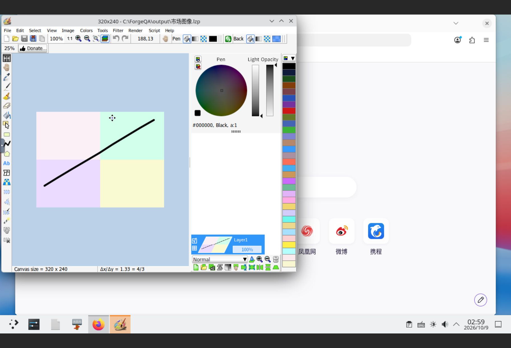
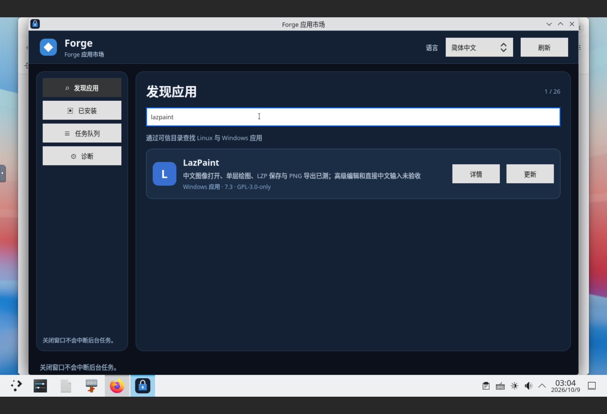

# Windows 滚动适配：LazPaint 7.3

LazPaint 7.3 的有限图像文件工作流及本地市场闭环已通过，累计 **24/1000**。覆盖中文文件名图像打开、单层画笔、LZP 原稿保存、24 位 PNG 导出、新进程重开，以及市场同版本更新、精确回滚和服务重启后的完整数据保留；完整图像编辑器未验收。

## 来源与安装

固定官方安装包、源码提交及 GPL-3.0-only 依据见[来源记录](evidence/2026-10-08-lazpaint-source.json)。安装包为官方 v7.3 的 `lazpaint7.3_setup_win32_win64.exe`，14,153,628 字节，SHA-256 `938fd2694247369f28fa219a8cf4b8c8a468c8691697e8c0519191ba2ecd3459`；源码提交 `a11930b418c7d9050886bd7d321fe78acfcd7ea6`。官方历史 Windows 资产未公布 GitHub 摘要，固定摘要来自官方 HTTPS 下载字节的本地计算和客体接收校验。Authenticode、可重复构建及完整组件许可闭包未验收。

[原安装](evidence/2026-10-08-lazpaint-installed-pending.json)的任务 `job-1791421778900-1` 成功，代次 `gen-job-1791421778900-1` 就绪；实际 GUI 标题为 7.3 (64-bit)。使用既有 Wine 11.14 win64 固定运行时、已核对的 x64 启动器；本轮产品代码未修改。

## 真实功能测试

原代次通过默认图像浏览器打开中文 PNG，在 320×240 四色图像上画黑色笔画，保留中文名保存 LZP，并用实际 GUI 的 24 位 PNG 编码选项导出。独立 PNG 解压、过滤还原及全部块 CRC 检查通过：1700 个像素改变，1073 个深色像素的所有 RGB 分量均小于 32，其中完全黑色 1016 个，四角原色保持。正常退出后，新管理进程分别明确打开 LZP 和 PNG，图像尺寸与笔画保持。见[后台证明](evidence/2026-10-09-lazpaint-backend.json)、[实际 PNG](evidence/2026-10-09-lazpaint/editor-created-original.png)及[冻结原 GUI 证明](evidence/windows-lazpaint-20261009.acceptance.json)。

原 GUI 任务 `job-1791508536714-1`、新进程重开任务 `job-1791510646663-2` 均退出 0。LZP 核对 magic、320×240 和单层头字段，并实际经 GUI 解析；不声称完整独立 LZP 解析器。

## 市场发布与生命周期

[发布记录](evidence/2026-10-09-lazpaint-publication.json)对应 `candidate-v25/tuf`，root 保持 1，targets/snapshot/timestamp 前进至 **34**。实际目录共 26 条，其中 24 款完成应用与 2 条内部夹具。29 个新公开签名文件逐字节核对，全部旧目录项和旧验收 target（包括 MPC-HC 原证明与更正证明）保留。使用 tuftool 0.17、明确的既有 trusted root 验证目录、LazPaint 证明及固定安装包下载，无信任重置、降级或过期绕过。签名私钥留在私有缓存。

冻结原 GUI 证明 SHA-256 为 `85d617b7e1f612f0a31dcf33ad53833eae7098c339e8e549c028af7bb04e41d7`，在签名前仅包含当时已完成的原 GUI 验收，并明确市场阶段待执行。后续市场证据另存，签名历史不重写。[激活记录](evidence/2026-10-09-lazpaint-activation.json)证明切换期间完整 180 条核心任务和 63 条市场记录及既有信任、配置、其他应用代次保留。

Store 同版本更新任务 `be9ed544-3827-409e-868e-ccd73941ab49` 成功，Core 安装任务 `job-1791513323789-3` 创建独立就绪代次 `gen-job-1791513323789-3`。新代次使用新四色夹具及相反方向笔画，未手工复制原代次设置。实际打开“市场图像.png”，通过 GUI 保存“市场图像.lzp”并导出 PNG。PNG 独立解码确认 **2025** 个像素改变、**1272** 个深色笔画像素、四角原色保持；4474 字节，SHA-256 `3e5626a1137f6ade350e3e722187df22cfb298093e16bb89ddb8a0539e19867f`。LZP 为 15362 字节、320×240、单层。新 GUI 任务 `job-1791513588386-4` 和新进程重开 `job-1791514770165-5` 均正常退出 0，LZP、PNG 均明确通过默认浏览器重开。见[市场 GUI 证明](evidence/2026-10-09-lazpaint-market-gui.json)及[编辑器实际输出](evidence/2026-10-09-lazpaint/editor-created-market.png)。

Store 回滚任务 `c9596a63-a50a-437b-ba9a-1fa287b8a7c5` 成功，精确返回原代次，两个代次保持就绪且两套输入、输出、启动器摘要保持。回滚未创建 Core 任务，核心数仍为 183；市场记录增加至 65。原代次 GUI 重开任务 `job-1791514921540-6` 明确打开原 LZP 与 PNG 后正常退出 0，核心总数成为 184。

全部任务终态后，通过正常用户服务命令重启 Core 与 Store。前后完整 **184 条核心任务、65 条市场 SQL 全字段、市场快照、所有配置摘要和注册应用代次、完整签名信任文档及服务保护项** 相等；已知时间仅向前，两套 LazPaint 输入/输出/启动器、旧 MPC-HC 两代 PNG 及不自动息屏设置均保持。[重启和恢复证明](evidence/2026-10-09-lazpaint-runtime-recovery.json)及客体私有完整检查点 `lazpaint-20261009/after-restart.json` 保存了核对结果；后续只读核对脚本为工作区私有 `.transfer/rolling-current-state-20261009.py`，旧总数脚本只代表历史。

服务重启后实际打开 ForgeStore GUI，发现页搜索 LazPaint，详情显示 7.3、GPL-3.0-only、tested、正确冻结证明引用及有限验收摘要；已安装页显示 LazPaint 与更新、回退、卸载控件。生命周期更新/回滚由 Store socket 入队，应用 GUI 和市场展示由浏览器实际观察，不声称点击 GUI 更新按钮完成的任务。关闭市场后只读检查完整状态与重启后检查点相等。

[最终独立校验](evidence/2026-10-09-lazpaint-final-verification.json)复核七个完整检查点、任务类型与退出结果、两套 PNG 像素和 CRC、原 23 项完成及 12 项阻塞、24 个图像证据摘要和 29 个签名公开文件。

[独立只读审查](evidence/2026-10-09-lazpaint-review.json)复核完整检查点、签名冻结包及有限验收范围，无阻塞发现。旧签名证明的 CRLF 属于原始签名字节，使用单次 `cr-at-eol` 空白检查保留这些字节，未改持久 Git 配置。

## 环境恢复、失败与限制

本轮开始前原虚拟机已发生一次外部重启，LightDM 未登录，CompatForge 随 `graphical-session.target` 保持停止。使用已授权现有账号正常登录后，KDE Wayland 与 Core 自动恢复，旧 178 条核心及 63 条市场全字段保持。期间桌面再次自动锁定，也通过现有账号正常解锁。认证和锁屏设置未修改；外部重启原因未据此推断，本轮未重启虚拟机。

最初路径输入的 `colon` 键名实际产生分号，改用 `Shift_L+semicolon` 后正确进入绝对路径。早期焦点、坐标、文件名编辑及直接中文输入尝试未建立可靠结果。市场阶段一组格式选择按键进入 JPEG 选项后被取消，未提交；后续显式选择 LZP/PNG 完成正确输出，目标 JPEG 不存在。所有尝试保留于[失败记录](evidence/2026-10-09-lazpaint-failures.json)。中文文件名通过保留输入名和 GUI 格式选择器获得，直接中文键盘输入不计通过。

高级图层、矢量、透明图像、动画、RAW、脚本、插件、打印、数位板、客体联网下载、新机器注册和跨版本升级仍未验收。市场更新只验证预缓存固定包的同版本独立安装，未据此声称异版本升级或完整图像编辑能力。

12 项既有阻塞候选及 PDF Arranger MSI 失败独立保留；本轮仅新增 LazPaint 一项。Ubuntu Kate 与 Snap 计算器仍独立两款通过，root 1 / 角色 4，Flatpak 两次运行时下载超时及缓存保留。只运行原 4 GiB Windows 兼容虚拟机，Ubuntu 虚拟机保持关闭。

