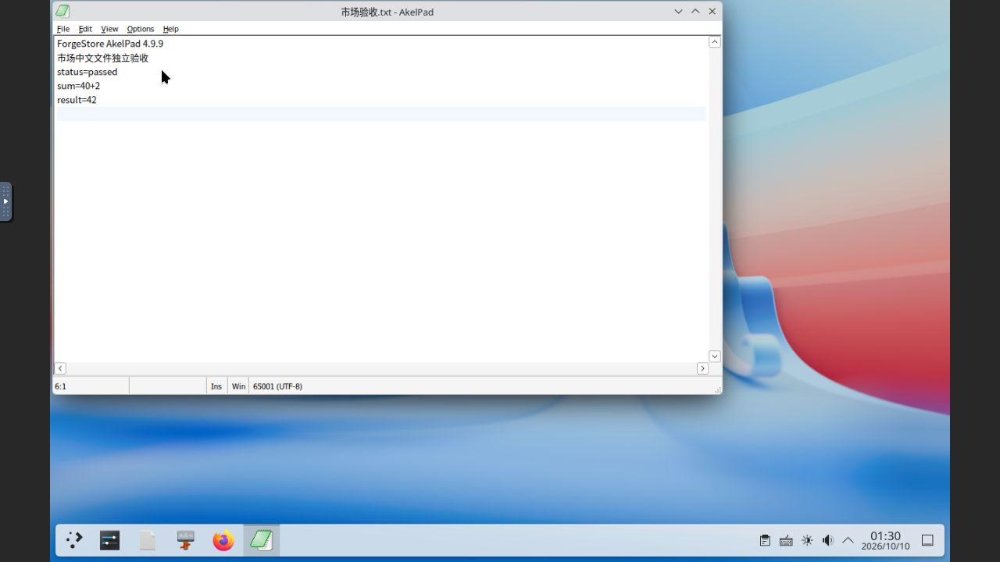
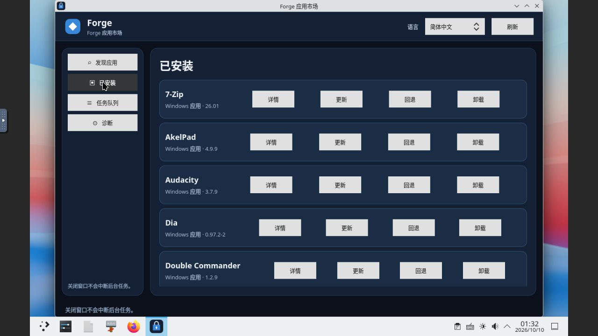

# Windows 滚动适配：AkelPad 4.9.9（2026-10-10）

本轮新增 1 款受限兼容应用，Windows 累计 **25/1000**。AkelPad 原代次与独立市场代次均完成真实文件编辑、保存和新进程重开，随后精确回滚并正常重启 Core/Store。12 项既有阻塞保留；Ubuntu 仍独立累计 2 款，Flatpak 下载阻塞未重试。

## 来源与许可

官方 [下载页](https://akelpad.sourceforge.net/en/download.php) 和固定 [4.9.9 发布目录](https://sourceforge.net/projects/akelpad/files/AkelPad%204/4.9.9/) 对应安装包 AkelPad-4.9.9-setup.exe（1,241,412 字节，SHA-256 ad63ea4048d68721701a3c0d2d9041a158e90789c7fc24526380607aad136aca）及固定源码归档。安装后的英文手册与源码归档手册字节一致，其明确声明通用 BSD license。旧 OSI 链接不可取回，未将通用声明推断为 BSD-2-Clause 或 BSD-3-Clause，市场显示“BSD (upstream declaration; clause count unverified)”。确切 SPDX 与全部捆绑组件许可闭包仍未核验。

实际 About 显示 4.9.9 (x86)，受管环境为 Wine 11.14 win64。NSIS /S 和末尾 /D=C:\AkelPad 按官方参数规则执行。官方 HTTPS 下载的实测摘要用于固定字节；不声称上游公布密码学摘要、Authenticode 或可复现构建。详见 [来源记录](evidence/2026-10-10-akelpad-source.json)。

## GUI 与实际文件

原代次 gen-job-1791594584878-1 打开“中文验收.txt”，显示中文和 UTF-8，普通替换 before→after，追加 result=42，通过 GUI Save As 将保留中文名的文件写入 output 目录，BOM 及 CRLF 保持。正常退出后重新创建进程并显式重开输出。实际文件为 98 字节，SHA-256 176b23ca4684370f912a712945cedd60292bf419c2dbea79f6851d4294235f1a；原输入 88 字节保持不变。

ForgeStore 预缓存同版本更新创建独立代次 gen-job-1791595434904-4，未复制原代次配置或输出。重新打开独立“市场验收.txt”，普通替换 pending→passed，追加 result=42，GUI Save As 和新进程显式重开通过。实际市场输出 97 字节，SHA-256 0d7d96ac98adc0d893e82bf34dee9d0001039819e590077836767f1b4d9f12ac；原市场输入 87 字节保持不变。两套实际输入/输出以 .utf8 文件保留 BOM/CRLF 原字节，并在 .gitattributes 禁用文本转换。

最初快速键入搜索字段只得到部分字符，错误替换四处后通过正常 Undo 恢复，未保存错误内容。按键保持 150 ms 并提交前截图核对字段后，实际替换一处成功。缺少 7z、旧地址连接超时和核验工具引用/时间解析错误均保留于 [失败记录](evidence/2026-10-10-akelpad-failures.json)，未据此改动产品行为。

## 签名、本地市场及生命周期

candidate-v26/tuf 使用现有 root 1，targets/snapshot/timestamp 前进到 35；27 条市场记录包含 25 款应用与 2 项夹具。原 GUI 证明先冻结，SHA-256 1d1cb2ab469daa3c0a962af2388c1cea23fd6b04aed83da7253142312f7d766f，原证明中的“市场待执行”作为历史事实保留，后续 [发布记录](evidence/2026-10-10-akelpad-publication.json) 单独记录完成结果。旧全部目标及 MPC-HC 原/更正证明和 LazPaint 证明原字节不变。显式 trusted root 的 tuftool 0.17 下载核对目录、AkelPad 原证明和固定安装包，无跳过签名或过期校验。

更新与回滚由 Store IPC enqueue 提交，未将按钮显示记作按钮操作。更新 f64d305a-0d7a-4ef1-b434-0425c99bf48e 与回滚 4ae6e219-bdb4-4ac6-bc03-7fdefe23dff3 均 succeeded。回滚精确选中原代次，并新进程打开原输出；两个 ready 代次的数据均保留。正常 Core/Store 重启前所有任务终态，重启后 191 条 Core 完整任务、67 条 Store 完整 SQL 行、市场快照、全部配置摘要、应用代次、签名信任及服务保护字段一致，known time 单调前进。原 LazPaint 四个输出及 MPC-HC 输出摘要和“不自动息屏”配置均保持。

私有完整检查点为 akelpad-20261010/after-restart.json，最新只读检查使用 L:/project/FOS/.transfer/rolling-current-state-20261010.py；旧固定总数脚本只代表旧检查点。宿主重启导致外层 IP 变化，沿已有 MAC 和严格已存主机密钥恢复原实例与仅回环 noVNC 转发。仅一个 4 GiB 测试虚拟机运行，Ubuntu 虚拟机保持关闭。采用已授权账号正常登录/解锁，认证及锁屏设置未修改；签名私钥、密码、凭据及私有完整检查点未提交仓库。

## 验收边界

仅覆盖中文名 UTF-8 BOM/CRLF 文本打开、普通替换、ASCII 追加、保存及新进程重开；不是完整编辑器验收。直接中文键盘输入、正则/其他编码/大文件、插件/脚本/更新器/打印、联网客体下载、新机器注册、配置迁移和跨版本升级未验收。市场摘要及台账明示范围。独立复核和最终字节验证见发布记录所列证据。

## 源码同步边界

推送前发现远端 feature/store-core 已合入 fe66b1aa8be8de4fc84b7418e2177d0b4a04c5cb（Provider v2 协议检查）。本轮证据以普通同步方式保留该提交，未部署新源码到测试虚拟机。AkelPad 验收对应现有已固定的 CompatForge managed-msi-v10 和 ForgeStore managed-msi-v2 二进制，实测摘要列在最终验证记录；不声称新 Provider v2 服务、镜像或应用 GUI 已通过本轮验收。

新合入的 Provider composition Python 测试在外层 Linux 独立目录按精确 Git 源码字节执行，6 项通过，范围为 synthetic-contract-only。此检查不构成新 Provider v2 的客体安装或 GUI 验收。
